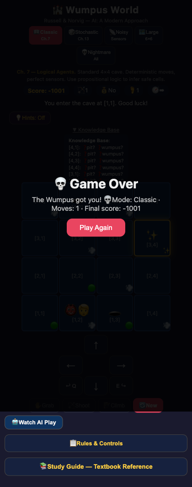
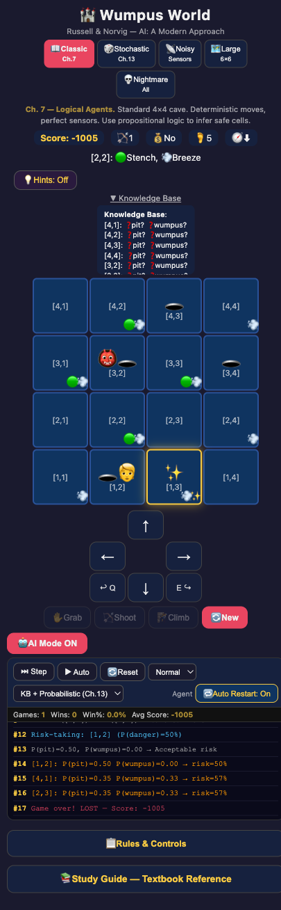

# Wumpus World

**[▶ Play it live](https://ashutoshnaveen.github.io/wumpus-world/)**

Browser-based Wumpus World game from Russell & Norvig's *AI: A Modern Approach* (Section 7.2). Everything runs from a single HTML file, no build step or dependencies needed. Works offline, works on phones.

Built this to have something playable while studying the logical inference chapters. The five modes cover the main variants discussed in the textbook.

<p align="center">
  
  
</p>

## Game Modes

| Mode | Grid | Sensors | Movement | Wumpi | Chapter |
|------|------|---------|----------|-------|---------|
| Classic | 4×4 | Perfect | Deterministic | 1 | Ch. 7 |
| Stochastic | 4×4 | Perfect | 20% slip | 1 | Ch. 13 |
| Noisy Sensors | 4×4 | Stench/Breeze flip 10% | Deterministic | 1 | Ch. 13 |
| Large Cave | 6×6 | Perfect | Deterministic | 2 | - |
| Nightmare | 6×6 | Noisy | 20% slip | 2 | All of the above |

## Mechanics

Follows the textbook rules closely:

- Stench when adjacent to Wumpus, breeze when adjacent to pit, glitter when on the gold cell
- Agent has a facing direction. Arrow shoots straight in that direction until it hits something or a wall
- Scoring: +1000 for escaping with gold, -1000 for death, -1 per action, -10 per arrow
- Gold is always placed on a cell reachable from the start (BFS check, pits block movement)

## Knowledge Base Overlay

Toggle "▶ Knowledge Base" to reveal a live inference panel below the grid. For every unvisited cell it shows what has been deduced so far:

- **✅ Safe** — `KB ⊨ ¬Pit(cell) ∧ ¬Wumpus(cell)` derived from adjacent visited cells with no breeze/stench.
- **❓pit? / ❓wumpus?** — danger status still unknown.
- **🚫pit / 🚫wumpus** — ruled out by inference but the other hazard is still unresolved.

In Noisy Sensors mode the overlay adds a warning that percepts may be unreliable.

## Hint System

Click "💡 Hints: Off" to turn on context-sensitive hints. Hints update after every move and are based on the current percepts and KB state:

- **Glitter detected** — reminds you to grab the gold.
- **Breeze/Stench analysis** — if only one adjacent cell is uncleared, the hint identifies it as the likely hazard with the propositional logic rule (e.g. `KB ⊨ Breeze ∧ all-other-adj-safe → Pit`). If multiple candidates exist it says so.
- **Safe frontier** — lists known-safe unvisited cells to explore next.
- **Gold in hand** — directs you back to [1,1] to climb out.
- **At exit with gold** — tells you to press Climb.

Click "Next Hint →" to cycle through all available hints for the current position.

## Study Guide

A collapsible reference panel ("📚 Study Guide") that maps each game mechanic to the relevant textbook section:

- Ch. 7 — Propositional logic, knowledge base, entailment, inference rules (Modus Ponens, resolution).
- Ch. 13 — Uncertainty, probability, Bayesian reasoning, sensor noise, stochastic actions.
- Formulas for calculating pit/wumpus probability from adjacent observations.
- Definitions of key concepts: model checking, soundness, completeness, satisfiability.

## AI Agent

Click "🤖 Watch AI Play" to hand control to an automated agent. Two agent types:

### KB Agent (Ch. 7)

Pure propositional logic agent:

1. Observes percepts at the current cell and updates its knowledge base.
2. Marks adjacent cells as safe if no breeze and no stench: `¬Breeze(x,y) → ¬Pit(adj)`.
3. Picks the nearest unvisited safe cell (BFS) and navigates there.
4. Deduces Wumpus location by elimination — if stench is detected and all but one adjacent cell are cleared, it infers `Wumpus(cell)`, faces it, and shoots.
5. When no safe frontier remains, retreats to [1,1] and climbs out.

### KB + Probabilistic Agent (Ch. 13)

Extends the KB agent with risk assessment:

1. Runs the same KB inference as above.
2. When the safe frontier is exhausted, estimates `P(pit)` and `P(wumpus)` for each unknown cell using constraint counts from adjacent breeze/stench observations.
3. If the lowest-danger cell is below a risk threshold, it moves there (calculated risk).
4. Probability overlays appear on unexplored cells showing `P=X%` and `W=X%`.
5. Falls back to retreat if no move is acceptably safe.

### AI Controls

| Control | Description |
|---------|-------------|
| ⏭ Step | Execute one AI decision |
| ▶ Auto | Continuous play at selected speed |
| ⏸ Pause | Stop auto-play |
| 🔄 Reset | Start a new game with fresh KB |
| Speed | Slow (800ms) / Normal (400ms) / Fast (150ms) / Turbo (50ms) |
| Agent | Switch between KB and KB+Probabilistic |
| 🔁 Auto Restart | On: starts a new game automatically after game over. Off: pauses after each game so you can inspect the result. |

### AI Architecture

```
┌─────────────────────────────────────────────────┐
│                  Agent Loop                      │
│                                                  │
│  Percepts ──► KB Update ──► Inference ──► Action  │
│  (breeze,      (assert      (safe?        (move,  │
│   stench,       facts)       wumpus?       shoot, │
│   glitter)                   prob?)        grab)  │
│                                                  │
│  KB Agent:     ¬Breeze(x) → ¬Pit(adj)           │
│                Stench ∧ 1-unknown → Wumpus(cell) │
│                                                  │
│  Prob Agent:   P(pit|evidence) from constraint   │
│                counts on adjacent observations    │
│                Risk threshold → move or retreat   │
└─────────────────────────────────────────────────┘
```

### Stats Dashboard

Tracks across auto-play runs:
- **Games** — total games played
- **Wins** — games where the agent escaped with gold (score > 0)
- **Win%** — win rate percentage
- **Avg Score** — mean score across all games

Typical results over 200 Classic-mode games: KB agent ~34% win rate, KB+Probabilistic agent ~63% win rate.

## Gameplay Analysis

Every human game ends with an automatic **report card** — no AI mode, no external API, runs entirely offline.

A **shadow KB agent** runs in parallel with the player, tracking what a logical agent would know at each step. After game over, each move is classified:

| Rating | Meaning |
|--------|--------|
| ✅ **Good / Perfect** | Moved to a provably safe cell or took the correct action (grab gold, climb at exit) |
| · **OK** | Neutral action (turn, shoot) |
| ⚠️ **Risky** | Entered a cell with possible pit or Wumpus (not proven safe by KB) |
| ❌ **Mistake** | Chose an unknown cell when a safe frontier option existed |
| 💥 **Blunder** | Missed grabbing gold, or climbed out with safe cells still unexplored |

The report card shows:
- **Grade (A–F)** — based on accuracy percentage and blunder count
- **Accuracy %** — ratio of good/OK moves to total moves
- **Move-by-move log** — color-coded with the AI's suggested alternative for each mistake
- **Study suggestions** — maps mistakes to textbook sections (e.g., "Section 7.3 — Moved into cell with possible pit")

## How to Play

**Online:** [ashutoshnaveen.github.io/wumpus-world](https://ashutoshnaveen.github.io/wumpus-world/)

**Offline:** Download the page (File → Save As, or right-click → Save As HTML) and open `index.html` in any browser. Everything is self-contained in a single file — no internet required.

```bash
# or serve it locally
python3 -m http.server 8000
```

## Controls

| Action | Keyboard | Mobile |
|--------|----------|--------|
| Move | Arrow keys / WASD | Direction buttons |
| Turn Left/Right | Q / E | ↩ ↪ buttons |
| Grab gold | G | ✋ Grab |
| Shoot arrow | F | 🏹 Shoot |
| Climb out | C | 🧗 Climb |

## Tests

`simulate.js` runs 17 test suites covering world generation, percepts, movement, turning, shooting, grabbing, climbing, scoring, stochastic slip rates, noisy sensor flipping, coordinate mapping, and edge cases. Also ran 1500+ automated playthroughs in Playwright across all modes.

```bash
$ node simulate.js

▶ TEST 1:  World Generation — 100 games × 5 modes = 500 worlds
▶ TEST 2:  Movement Mechanics
▶ TEST 3:  Turn Mechanics
▶ TEST 4:  Shoot Mechanics
▶ TEST 5:  Grab Mechanics
▶ TEST 6:  Climb Mechanics
▶ TEST 7:  Scoring — Perfect game walkthrough
▶ TEST 8:  Noisy Sensors — 1000 perception tests
▶ TEST 9:  Stochastic Mode — 500 moves
▶ TEST 10: Deterministic Mode — 200 moves, 0 slips
▶ TEST 11: Full Gameplay — 100 games × 5 modes
▶ TEST 12: Stench removal after Wumpus kill
▶ TEST 13: Coordinate System
▶ TEST 14: All actions blocked after gameOver
▶ TEST 15: Large/Nightmare — Multiple Wumpi
▶ TEST 16: Gold Reachability — 1000 games × 5 modes = 5000 worlds
▶ TEST 17: Smart Agent — 500 games, visit all reachable cells, always find gold

✅ ALL TESTS PASSED — Game 100% aligns with Russell & Norvig Section 7.2
```

## Features at a Glance

- 5 game modes (Classic → Nightmare)
- Full KB inference with live overlay
- Two AI agents (KB and Probabilistic) with auto-play
- Context-sensitive hint system
- Post-game gameplay analysis with grade & suggestions
- Textbook study guide with formulas
- PWA / offline support
- Mobile responsive with touch & swipe
- Single HTML file, zero dependencies

## References

Russell, S. & Norvig, P. (2020). *Artificial Intelligence: A Modern Approach* (4th ed.), Sections 7.2, 7.4, 13.1.

## License

MIT
